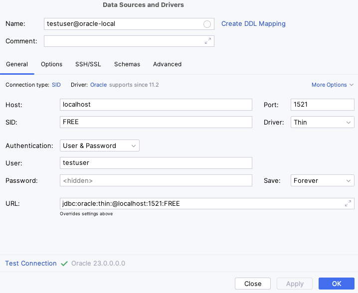

# Oracle Databse Free docker container on M1 Mac (ARM)

Oracle does not provide a native M1 Mac version of their docker image. We will use the offical [Oracle Database Free](https://www.oracle.com/database/free/get-started/) that only provides docker images build for `linux/amd64`.

This is a workaround to run the container on M1 Macs. It uses [colima](<https://github.com/abiosoft/colima>) to run the container in a virtual machine.

If you are using an Intel Mac or linux you can skip the colima setup and use the docker image directly.

## Setup colima

### Install

```sh
brew install colima
```

### Start

I use the profile name `oracle` otherwise you can use any name you like or none at all. Then colima will use the default profile.

```sh
colima start -p oracle -c 4 -m 12 -a x86_64
```

### Stop

```sh
colima stop oracle
```

### Remove

```sh
colima delete oracle
```

## Start docker container

### Use the colima context that is will be started by colima

If you use a custom profile name, it will be extended to the docker context name.

```sh
docker context use colima-oracle
```

### Start the container

The oracle registry requires a login. You can use your oracle account to login.

```sh
docker login container-registry-frankfurt.oracle.com
```

I use an european registry mirror to speed up the download. You can ajust the mirror to your location when logging in and also in the `docker-compose.yml` file. The download speed is still slow, but for me it is faster than the original registry.

```sh
docker run -d --name oracle-local -p 1521:1521 container-registry.oracle.com/database/free:latest
```

or use the `docker-compose.yml` file

```sh
docker-compose up -d
```

## Connect to database

### Connect with sqlplus

```sh
docker exec -it oracle-local bash -c "sqlplus /nolog"
```

### Login as sysdba

```sql  
conn / as sysdba
alter session set "_ORACLE_SCRIPT"=true;  
```

### Create user and grant privileges

```sql  
create user testuser identified by testuser quota unlimited on users;
grant connect,
    resource to testuser;
grant create session to testuser;
grant unlimited tablespace to testuser;
grant db_developer_role to testuser;
grant execute on dbms_debug_jdwp to testuser;
```

### Delete user

```sql
drop user testuser cascade;
```

### Connect with user

```sh
docker exec -it oracle-local bash -c "source /home/oracle/.bashrc; sqlplus testuser/testuser"
```

### Datagrip setup


